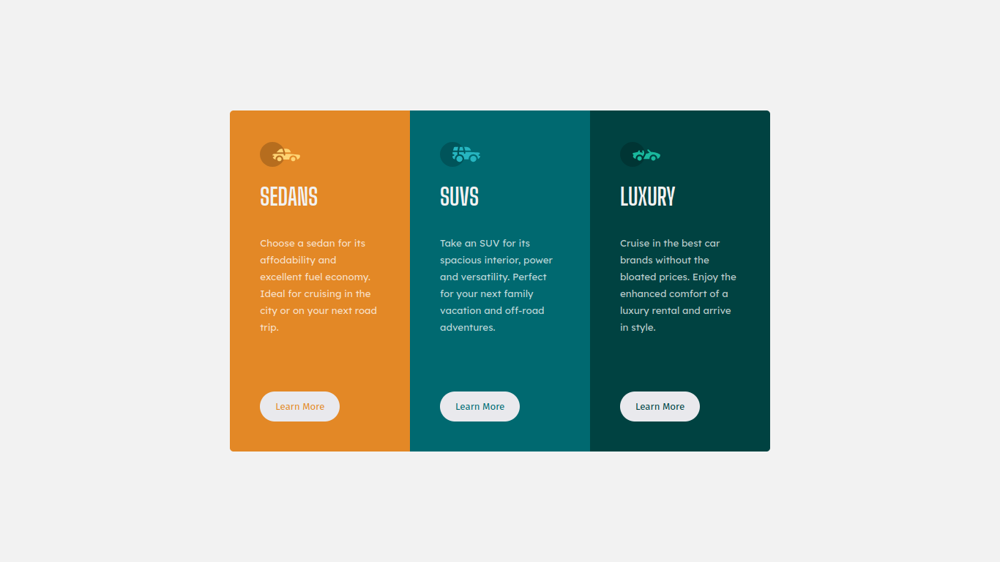

# Frontend Mentor - 3-column preview card component solution

This is a solution to the [3-column preview card component challenge on Frontend Mentor](https://www.frontendmentor.io/challenges/3column-preview-card-component-pH92eAR2-). Frontend Mentor challenges help you improve your coding skills by building realistic projects. 

## Table of contents

- [Overview](#overview)
  - [Screenshot](#screenshot)
  - [Links](#links)
- [Author](#author)

## Overview

### Screenshot

### Links

- Solution URL: [GitHub](https://github.com/gabcchaves/3-column-preview-card-component-main)
- Live Site URL: [Site](https://gabcchaves.github.io/3-column-preview-card-component-main)

### Built with

- HTML5
- CSS3

## Author

- Website - [Gabriel Costa Chaves](https://gabcchaves.github.io)
- Frontend Mentor - [@gabcchaves](https://www.frontendmentor.io/profile/gabcchaves)
